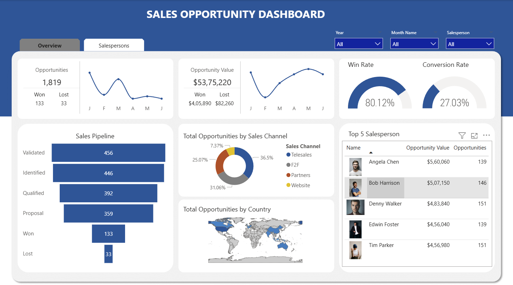
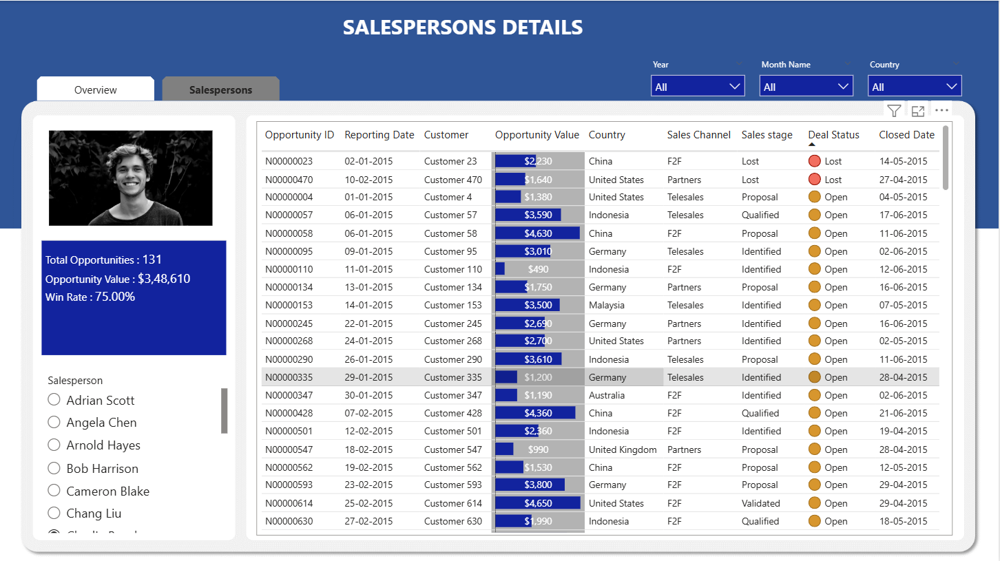

# **Sales Opportunity Dashboard - Power BI**

This project is a **Power BI dashboard** designed to analyze **sales opportunities, pipelines, conversion rates, and top-performing salespersons** using dynamic, interactive visuals.
The goal is to help **sales teams, managers, and business analysts** track performance, identify bottlenecks, and make informed, data-driven decisions.

---

## ✅ **Key Features**

* **Sales Overview Metrics**
  Monitor total opportunities, won vs. lost deals, and overall opportunity value.

* **Sales Pipeline Analysis**
  Visualize each stage of the sales process — from identification to closure — using a funnel chart.

* **Win & Conversion Rate KPIs**
  Track performance indicators with dynamic percentage visuals for quick insights.

* **Sales Channel Analysis**
  Compare opportunities across multiple channels such as **Telesales, Partners, F2F, and Website**.

* **Geographical Insights**
  Explore opportunities distribution by country with a **map-based visualization**.

* **Top 5 Salespersons Leaderboard**
  Identify top performers by opportunity value and deal count.

* **Detailed Salesperson View**
  Drill down to see each salesperson’s total opportunities, win rate, and detailed opportunity records.

* **Time-Based Filtering**
  Analyze performance by **year and month** using intuitive slicers.

---

## ✅ **Project Files**

* `Sales_Opportunity_Dashboard.pbix` – Power BI report with complete visuals and KPIs
* `Dataset/` – Sample sales opportunity data files (CSV/Excel)
* `README.md` – Project overview and usage guide

---

## ✅ **Use Case**

This dashboard is ideal for **sales departments, business intelligence teams, and performance managers** who want to:

* Track **total sales opportunities** and **pipeline progress**
* Compare **won vs. lost deals**
* Identify **top sales channels and salespersons**
* Monitor **conversion rates and opportunity value trends**
* Gain **geographic insights** on where opportunities are concentrated

---

## ✅ **Tech Stack**

* **Power BI Desktop** – for data modeling and visualization
* **DAX** – for calculated measures and KPIs
* **Excel / CSV datasets** – for opportunity, customer, and sales data

---

## ✅ **Screenshots**

**Dashboard Overview**

**Salespersons Details**

---

## ✅ **How to Use**

1. Download the `.pbix` file from this repository
2. Open it in **Power BI Desktop**
3. Load the dataset provided or connect your own sales data
4. Use filters to analyze by **Year**, **Month**, or **Salesperson**
5. Explore visuals for KPIs, pipelines, and top performers

---

## ✅ **License**

This project is shared for **portfolio and learning purposes**. You are welcome to **fork, explore, and enhance** it.

---

## ✅ **Author**

**Sayed Ibrahim**
*Data Analyst | Power BI Developer*

Connect on [**LinkedIn**](https://www.linkedin.com/in/sayed-ibrahim-m)
